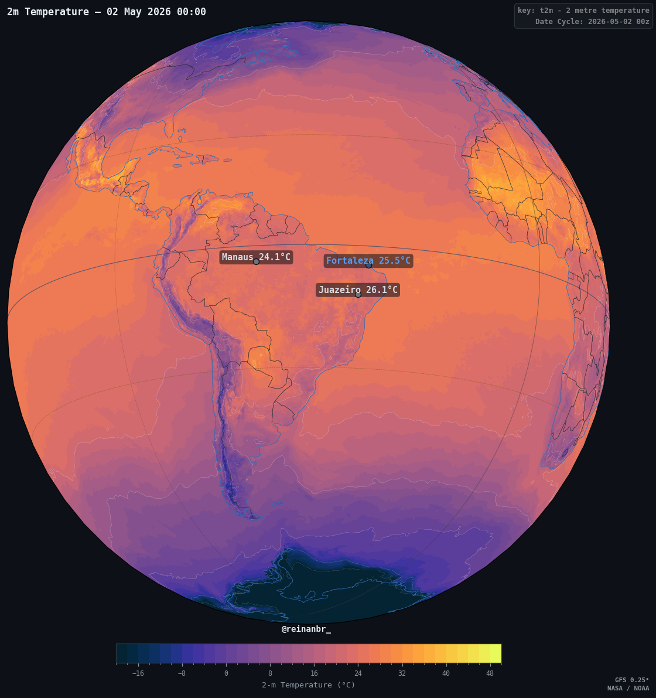
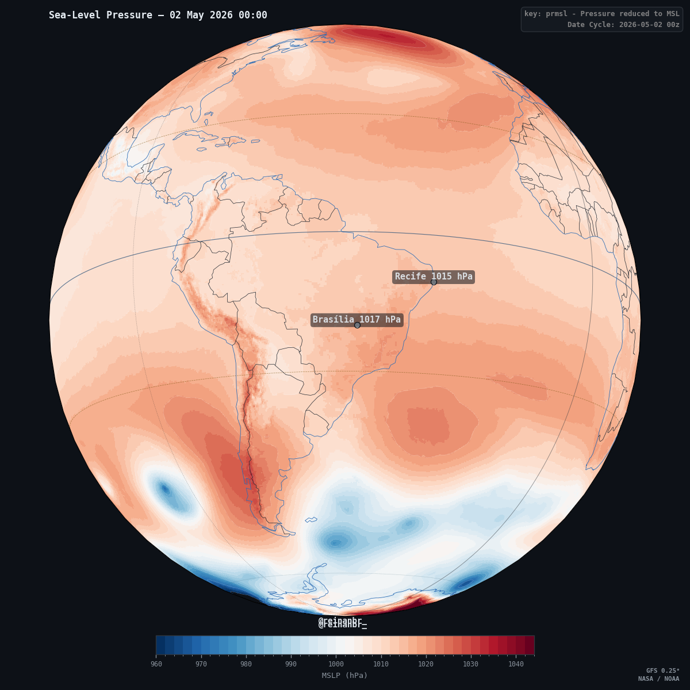
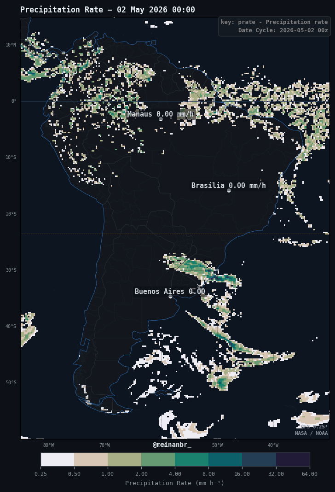
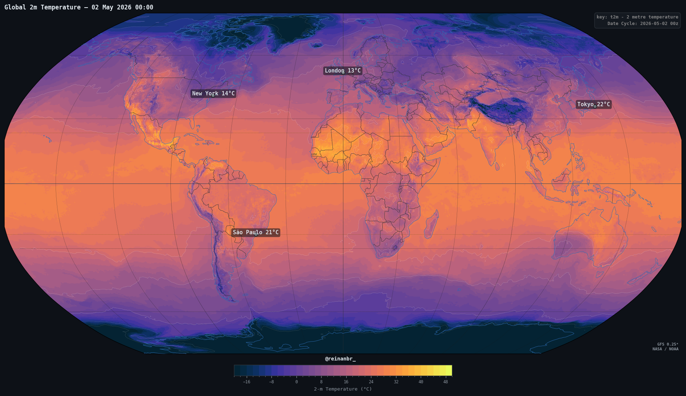
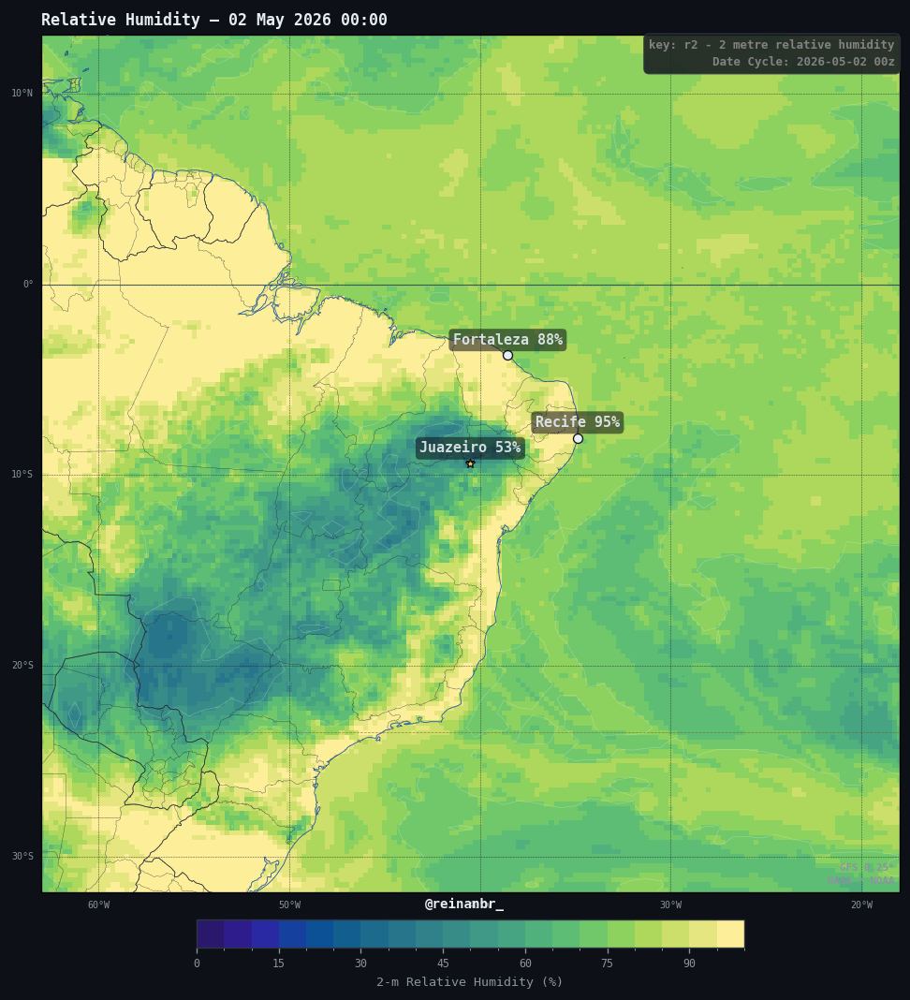
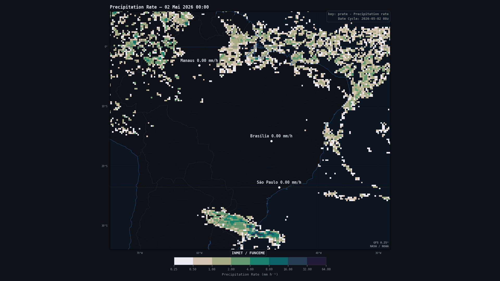

# noaawc

**noaawc** is a Python library for rendering animated and static meteorological maps from GFS (Global Forecast System) data. It provides a high-level API to create publication-quality, dark-themed weather visualizations — four projection modes, smooth camera rotation, per-frame annotations, dynamic titles, and export to MP4 or GIF.

> **noaawc** is built on top of [**noawclg**](https://github.com/your-org/noawclg) — the companion library responsible for downloading, parsing, and organizing GFS GRIB2 data into `xarray.Dataset` objects ready for visualization.

---

## Table of Contents

- [How It Fits Together](#how-it-fits-together)
- [Features](#features)
- [Installation](#installation)
- [Quick Start](#quick-start)
- [WeatherAnimator — Unified Entry Point](#weatheranimator--unified-entry-point)
- [Projection Modes](#projection-modes)
  - [OrthoAnimator](#orthoanimator)
  - [NearsidePerspectiveAnimator](#nearsideperspectiveanimator)
  - [PlateCarreeAnimator](#platecarreeanimator)
  - [RobinsonAnimator](#robinsonanimator)
- [Shared API Reference](#shared-api-reference)
  - [Quality Presets](#quality-presets)
  - [Output Options](#output-options)
  - [Colormap & Levels](#colormap--levels)
  - [Variable Presets](#variable-presets)
  - [Titles & Labels](#titles--labels)
  - [Camera Rotation](#camera-rotation)
  - [Map Annotations](#map-annotations)
  - [Static Snapshot](#static-snapshot)
  - [Rendering the Animation](#rendering-the-animation)
- [Supported Variables](#supported-variables)
- [Visual Style](#visual-style)
- [Examples](#examples)
- [Dependencies](#dependencies)

---

## How It Fits Together

noaawc is the **visualization layer** of a two-library pipeline:

```
noawclg  ──────────────────────────────────────────►  noaawc
  │                                                      │
  │  Downloads GFS GRIB2 files from NOAA servers         │  Renders animated / static
  │  Parses variables, levels, and forecast hours        │  orthographic, satellite,
  │  Converts units (K→°C, Pa→hPa, etc.)                │  flat, or Robinson maps
  │  Returns xarray.Dataset with a time dimension        │  from xarray Datasets
  └──────────────────────────────────────────────────────┘
```

### Typical workflow

```python
# Step 1 — download GFS data with noawclg
import noawclg

ds = noawclg.load(
    var="t2m",
    run_date="20260417",
    cycle="00z",
    forecast_hours=range(0, 121, 3),
)

# Step 2 — visualize with noaawc
from noaawc.weather import WeatherAnimator

anim = WeatherAnimator(ds, "t2m", mode="ortho")
anim.set_output("temperature.mp4")
anim.animate()
```

---

## Features

- 🌍 **Four projection modes** — orthographic globe, nearside perspective (satellite), PlateCarrée (flat regional), and Robinson (world map)
- 🎨 **Dark theme** optimized for social media and presentation use
- 📦 **50+ variable presets** — colormaps, level ranges, and labels auto-loaded for every GFS variable
- 🗃️ **VARIABLES_INFO metadata** — GRIB2 identifiers, level types, unit converters, and long names
- 🏷️ **Dynamic frame titles** with per-frame timestamps and multi-language month names
- 📍 **Geo-referenced annotations** with configurable markers, labels, and field-value interpolation
- 🖼️ **Per-frame overlays**: info box (variable/cycle/date), data credit, and author label
- 🎬 **MP4 / GIF export** via imageio + ffmpeg, with quality presets from SD to 4K @ 60 fps
- 📸 **Static snapshot** mode for quick single-frame inspection
- ⚡ **Frame caching** — already-rendered PNG frames are reused on re-runs
- 🔗 **Method chaining** — all setters return `self`

---

## Installation

```bash
pip install noaawc
pip install noawclg
```

**System requirements:**

| Dependency | Purpose |
|---|---|
| `numpy` | Array operations |
| `matplotlib` | Rendering |
| `cartopy` | Map projections and geographic features |
| `cmocean` | Perceptually uniform oceanographic colormaps |
| `imageio[ffmpeg]` | Video encoding |
| `xarray` | GFS dataset interface |

Install ffmpeg separately for MP4 output:

```bash
# Ubuntu / Debian
sudo apt install ffmpeg

# macOS (Homebrew)
brew install ffmpeg

# Conda
conda install -c conda-forge ffmpeg
```

---

## Quick Start

```python
import noawclg
from noaawc.weather import WeatherAnimator

# Download GFS data
ds = noawclg.load(var="t2m", run_date="20260417", cycle="00z",
                  forecast_hours=range(0, 121, 3))

# Orthographic globe with rotation
anim = WeatherAnimator(ds, "t2m", mode="ortho")
anim.set_output("temperature.mp4")
anim.set_quality("hd")
anim.set_rotation(lon_start=-90, lon_end=-20, lat_start=-5, lat_end=-20)
anim.set_rotation_stop(fraction=0.65)
anim.animate()
```

---

## WeatherAnimator — Unified Entry Point

`WeatherAnimator` is a factory function that instantiates the correct animator
class for the chosen projection mode and returns the full animator object.

```python
from noaawc.weather import WeatherAnimator

anim = WeatherAnimator(ds, var, mode="ortho", **kwargs)
```

| Parameter | Type | Description |
|---|---|---|
| `ds` | `xarray.Dataset` | GFS dataset produced by **noawclg** |
| `var` | `str` | Variable key (e.g. `"t2m"`, `"prmsl"`, `"prate"`) |
| `mode` | `str` | Projection mode — see table below |
| `**kwargs` | | Mode-specific constructor arguments (see each class) |

### Available modes

| mode | Class | Aspect | Best for |
|---|---|---|---|
| `"ortho"` | `OrthoAnimator` | Square | Globe spin, hemisphere overviews |
| `"nearside"` | `NearsidePerspectiveAnimator` | Square | Geostationary satellite look |
| `"plate"` | `PlateCarreeAnimator` | 16:9 | Regional flat maps, broadcast |
| `"robinson"` | `RobinsonAnimator` | 16:9 | Global thematic maps |

```python
from noaawc.weather import list_modes
list_modes()
```

### Mode-specific init kwargs

```python
# ortho — set the default globe centre
WeatherAnimator(ds, "t2m", mode="ortho", central_point=(-50.0, -15.0))

# nearside — set sub-satellite point and altitude
WeatherAnimator(ds, "t2m", mode="nearside", lon=-50.0, lat=-15.0,
                satellite_height=35_786_000)

# plate / robinson — no constructor kwargs; use set_region() after init
WeatherAnimator(ds, "t2m", mode="plate")
```

---

## Projection Modes

### OrthoAnimator

Orthographic projection — camera at infinity, classic "view from space" with
no perspective distortion.

```python
anim = WeatherAnimator(ds, "t2m", mode="ortho", central_point=(-50, -15))
anim.set_zoom(2)                       # continental scale
anim.set_rotation(lon_start=-90, lon_end=-30, lat_start=-5, lat_end=-20)
anim.set_rotation_stop(fraction=0.65)
anim.animate()
```

**Camera / zoom setters:**

| Method | Description |
|---|---|
| `set_view(lon, lat, zoom=None)` | Recentre globe, optional zoom |
| `set_zoom(zoom)` | `1` = full hemisphere, `2` = 45° radius, `4` = 22.5°, … |
| `set_rotation(lon_start, lon_end, lat_start, lat_end)` | Define camera arc |
| `set_rotation_stop(fraction=None, frame=None)` | Freeze camera at a fraction of total frames |

---

### NearsidePerspectiveAnimator

Satellite / nearside perspective projection — camera at a finite altitude,
producing realistic foreshortening and a curved horizon.

```python
anim = WeatherAnimator(ds, "t2m", mode="nearside",
                       lon=-75.0, lat=0.0,
                       satellite_height=35_786_000)  # GOES-East
anim.animate()
```

**Altitude reference:**

| Height (m) | Description |
|---|---|
| 200 000 | Low Earth Orbit — very tight view |
| 3 000 000 | Regional — South America fills the disk |
| **35 786 000** | **Geostationary (GOES / Meteosat / Himawari) — default** |
| 100 000 000 | Near-orthographic |

**Camera setters:**

| Method | Description |
|---|---|
| `set_view(lon, lat, satellite_height=None)` | Sub-satellite point + altitude |
| `set_satellite_height(height)` | Set altitude in metres |
| `set_rotation(...)` | Same arc API as OrthoAnimator |
| `set_rotation_stop(...)` | Same freeze API as OrthoAnimator |

---

### PlateCarreeAnimator

Equirectangular flat map, 16:9 output. Must set a region before rendering.

```python
anim = WeatherAnimator(ds, "t2m", mode="plate")
anim.set_region("south_america")
anim.set_states()
anim.animate()
```

**Named regions:**

| Key | Lat range | Lon range |
|---|---|---|
| `"south_america"` | −60 … 15 | −85 … −30 |
| `"brazil"` | −34 … 6 | −75 … −28 |
| `"northeast_br"` | −18 … −1 | −47 … −34 |
| `"north_br"` | −5 … 5.5 | −74 … −44 |
| `"southeast_br"` | −25.5 … −14 | −53 … −39 |
| `"south_br"` | −34 … −22 | −58 … −47 |
| `"global"` | −85 … 85 | −180 … 180 |

**Region setters:**

```python
anim.set_region("brazil")                              # named shortcut
anim.set_region(toplat=5, bottomlat=-35,
                leftlon=-75, rightlon=-34)             # keyword args
anim.set_zoom(zoom=4, pos=(-9.4, -40.5))              # zoom around a point
anim.set_ocean(True)                                   # ocean fill (default: on)
anim.set_grid(True)                                    # gridlines + labels (default: on)
```

---

### RobinsonAnimator

Robinson pseudo-cylindrical projection — visually balanced world map, 16:9 output.

```python
anim = WeatherAnimator(ds, "t2m", mode="robinson")
anim.set_region("global")
anim.animate()
```

**Named regions:**

| Key | Description |
|---|---|
| `"global"` | Full world |
| `"north_hemisphere"` | 0 … 85°N |
| `"south_hemisphere"` | 85°S … 0 |
| `"atlantic"` | Atlantic basin |
| `"pacific"` | Pacific basin |
| `"south_america"` | South America |
| `"africa"` | Africa |
| `"europe_asia"` | Europe + Asia |
| `"north_america"` | North America |
| `"asia"` | Asia |

**Region setters:**

```python
anim.set_region("global")
anim.set_region(toplat=85, bottomlat=-85, leftlon=-180, rightlon=180,
                central_longitude=-60)   # Atlantic-centred
anim.set_zoom(zoom=2, pos=(20.0, 10.0)) # Africa + Europe
```

---

## Shared API Reference

All setters return `self` — full method chaining is supported.

### Quality Presets

```python
anim.set_quality("sd")     # 72 dpi,  fast preview
anim.set_quality("hd")     # 120 dpi, 24 fps (default)
anim.set_quality("4k")     # 220 dpi, 30 fps
anim.set_quality("4k_60")  # 220 dpi, 60 fps
```

**Square (Ortho / Nearside):**

| Preset | DPI | Size (in) | Resolution | FPS |
|---|---|---|---|---|
| `sd` | 72 | 8 × 8 | 576 × 576 | 6 |
| `hd` | 120 | 10 × 10 | 1200 × 1200 | 24 |
| `4k` | 220 | 17.07 × 17.07 | ~3755 × 3755 | 30 |
| `4k_60` | 220 | 17.07 × 17.07 | ~3755 × 3755 | 60 |

**Wide 16:9 (PlateCarrée / Robinson):**

| Preset | DPI | Size (in) | Resolution | FPS |
|---|---|---|---|---|
| `sd` | 72 | 17.78 × 10 | 1280 × 720 | 6 |
| `hd` | 120 | 16 × 9 | 1920 × 1080 | 24 |
| `4k` | 220 | 17.45 × 9.82 | 3840 × 2160 | 30 |
| `4k_60` | 220 | 17.45 × 9.82 | 3840 × 2160 | 60 |

Individual overrides:

```python
anim.set_quality("4k").set_fps(24)       # 4K pixels, cinematic 24 fps
anim.set_dpi(300)                        # print-quality stills
anim.set_figsize(17.07, 17.07)
anim.set_codec("libx265")                # H.265 — ~40% smaller files
anim.set_video_quality(10)               # 0 (worst) – 10 (best)
```

---

### Output Options

```python
anim.set_output("output.mp4")   # MP4 or GIF
anim.set_fps(24)
anim.set_step(2)                # spatial decimation (1 = full resolution)
anim.set_codec("libx264")       # libx264, libx265, vp9, prores
anim.set_video_quality(8)       # 0–10
```

---

### Colormap & Levels

```python
import numpy as np
import cmocean

anim.set_cmap(cmocean.cm.thermal)
anim.set_cmap("RdBu_r")
anim.set_levels(np.arange(960, 1040, 2))
anim.set_levels(np.linspace(-30, 45, 40))
anim.set_cbar_label("Temperature (°C)")
anim.set_plot_title("Surface Temperature")
```

---

### Variable Presets

```python
from noaawc.weather import list_variable_presets
list_variable_presets()

anim.use_variable_defaults("prmsl")
anim.use_temperature_defaults()
anim.use_pressure_defaults()
anim.use_precipitation_defaults()
anim.use_humidity_defaults()
anim.use_wind_speed_defaults()
```

---

### Titles & Labels

Use `%S` as a placeholder — replaced with the frame timestamp at render time:

```python
anim.set_title("Surface Temperature  %S")
# → "Surface Temperature  17 Apr 2026 03:00"

anim.set_title("Temperatura da Superfície — %S", date_style="pt-br")
# → "Temperatura da Superfície — 17 Abr 2026 03:00"
```

| `date_style` | Month example | Full example |
|---|---|---|
| `"en"` (default) | Apr | 17 Apr 2026 03:00 |
| `"pt-br"` | Abr | 17 Abr 2026 03:00 |
| `"es"` | Abr | 17 Abr 2026 03:00 |
| `"fr"` | Avr | 17 Avr 2026 03:00 |

Author label:

```python
anim.set_author("Maria Silva")
anim.set_author("@msilva_met", x=0.98, ha="right", color="#58a6ff")
anim.set_author("INMET / FUNCEME", bbox=True)
anim.set_author("")   # disable
```

---

### Camera Rotation

*(OrthoAnimator and NearsidePerspectiveAnimator only)*

```python
anim.set_rotation(lon_start=-90, lon_end=-20, lat_start=-5, lat_end=-20)
anim.set_rotation_stop(fraction=0.65)  # freeze at 65% of frames
anim.set_rotation_stop(frame=40)       # freeze at absolute frame 40
```

---

### Map Annotations

```python
# Circle marker + live field value
anim.set_annotate("Juazeiro: %.1f°C", pos=(-9.4, -40.5))

# Star marker, custom colour
anim.set_annotate(
    "Fortaleza: %.1f°C",
    pos=(-3.72, -38.54),
    marker="*", marker_size=10, marker_color="#f7c948",
    color="#58a6ff", text_offset=(0.5, 1.2),
)

# Text only
anim.set_annotate("Manaus", pos=(-3.10, -60.02), marker=None)

# Method chaining
(anim
    .set_annotate("Recife %.1f m/s",    pos=(-8.05,  -34.88))
    .set_annotate("Fortaleza %.1f m/s", pos=(-3.72,  -38.54))
    .set_annotate("Manaus %.1f m/s",    pos=(-3.10,  -60.02))
)

anim.clear_annotations()
```

**Full parameter reference:**

| Parameter | Default | Description |
|---|---|---|
| `text_base` | — | Label text; use `%d` / `%.1f` for field value |
| `pos` | — | `(lat, lon)` in decimal degrees |
| `size` | `9.0` | Font size at HD reference DPI |
| `color` | `"#e6edf3"` | Text colour |
| `weight` | `"bold"` | Font weight |
| `alpha` | `0.9` | Text opacity |
| `bbox` | `True` | Rounded background box |
| `bbox_color` | `"#0d1117"` | Box fill colour |
| `bbox_alpha` | `0.55` | Box opacity |
| `interpolate` | `True` | Replace `%…` placeholder with field value |
| `marker` | `"o"` | Marker symbol (`None` = no marker) |
| `marker_size` | `6.0` | Marker size |
| `marker_color` | `None` | Marker fill (inherits `color` if `None`) |
| `marker_edge_color` | `"#0d1117"` | Marker outline |
| `marker_edge_width` | `0.8` | Marker outline width |
| `marker_alpha` | `1.0` | Marker opacity |
| `text_offset` | `(0.0, 0.8)` | `(Δlon, Δlat)` shift in decimal degrees |

---

### Static Snapshot

```python
anim.plot(time_idx=0)                           # interactive window
anim.plot(time_idx=6, save="snapshot.png")      # save to file
anim.plot(time_idx=0, show=False, save="fig.png")

# OrthoAnimator — override camera for this plot only
anim.plot(time_idx=0, central_point=(-60.0, -20.0))

# NearsidePerspectiveAnimator — override camera for this plot only
anim.plot(time_idx=0, central=(-75.0, 0.0))
```

---

### Rendering the Animation

```python
anim.animate()
```

1. Creates `frames/<prefix>_<var>_<run_date>_<cycle>/`
2. Renders each time step as PNG (skips frames that already exist)
3. Encodes all frames into the output video

Frame directory prefixes: `<var>_` (ortho), `ns_<var>_` (nearside), `pc_<var>_` (plate), `rob_<var>_` (robinson).

---

## Supported Variables

### Surface temperature & dewpoint

| Key | Description | Colormap | Level range |
|---|---|---|---|
| `t2m` | 2-metre temperature | `cmocean.thermal` | −20 to 50 °C, step 2 |
| `d2m` | 2-metre dewpoint | `cmocean.haline` | −30 to 30 °C, step 2 |
| `aptmp` | Apparent temperature | `cmocean.thermal` | −30 to 50 °C, step 2 |

### Humidity

| Key | Description | Colormap |
|---|---|---|
| `r2` | 2-metre relative humidity | `cmocean.haline` |
| `sh2` | 2-metre specific humidity | `cmocean.haline` |
| `pwat` | Precipitable water | `cmocean.haline` |
| `cwat` | Column cloud water | `cmocean.ice` |

### Wind (10 m)

| Key | Description | Notes |
|---|---|---|
| `u10` | 10-m U component | Diverging |
| `v10` | 10-m V component | Diverging |
| `wspd10` | 10-m wind speed | **Derived** — see below |
| `gust` | Surface wind gust | |

### Pressure

| Key | Description |
|---|---|
| `prmsl` | Mean sea-level pressure |
| `mslet` | MSLP (Eta reduction) |
| `sp` | Surface pressure |

### Precipitation & hydrology

`prate`, `cpofp`, `crain`, `csnow`, `cfrzr`, `cicep`, `sde`, `sdwe`

### Cloud cover

`tcc`, `lcc`, `mcc`, `hcc`

### Convection & instability

`cape`, `cin`, `lftx`, `lftx4`, `hlcy`

### Upper-air (multi-level)

`t`, `r`, `q`, `gh`, `u`, `v`, `w`, `absv`, `wspd`

### Soil, diagnostics & other

`st`, `soilw`, `refc`, `siconc`, `orog`, `lsm`, `veg`, `vis`, `tozne`

### Derived wind speed variables

`wspd10` and `wspd` do not exist in GFS GRIB2 files directly. Compute them before use:

```python
import numpy as np

ds["wspd10"] = np.sqrt(ds["u10"] ** 2 + ds["v10"] ** 2)
ds["wspd"]   = np.sqrt(ds["u"]   ** 2 + ds["v"]   ** 2)

anim = WeatherAnimator(ds, "wspd10", mode="ortho")
```

---

## Visual Style

| Element | Colour |
|---|---|
| Figure / axes background | `#0d1117` |
| Land fill | `#13171d` |
| Ocean fill | `#0d1520` |
| Coastlines | `#2d6db5` |
| Country borders | `#2a2f36` |
| Grid lines | `#14181c` |
| Text (titles, labels) | `#e6edf3` |
| Subtitle / tick text | `#8b949e` |
| Info box background | `#161b22` |
| Info box border | `#30363d` |
| Font family | Monospace |

---

## Examples

### Static snapshots

#### Orthographic globe — single frame

```python
from noaawc.weather import WeatherAnimator

anim = WeatherAnimator(ds, "t2m", mode="ortho", central_point=(-50, -15))
anim.set_quality("hd")
anim.set_title("2m Temperature — %S")
anim.set_annotate("Juazeiro %.1f°C", pos=(-9.4, -40.5))
anim.plot(time_idx=0, save="ortho_t2m.png", show=False)
```

> 📷 **Example output:**
> 

---

#### Satellite view — single frame

```python
anim = WeatherAnimator(ds, "prmsl", mode="nearside",
                       lon=-50.0, lat=-15.0,
                       satellite_height=35_786_000)
anim.set_quality("hd")
anim.set_title("Sea-Level Pressure — %S")
anim.plot(time_idx=0, save="nearside_prmsl.png", show=False)
```

> 📷 **Example output:**
> 

---

#### Flat regional map — South America

```python
anim = WeatherAnimator(ds, "prate", mode="plate")
anim.set_region("south_america")
anim.set_states()
anim.set_quality("hd")
anim.set_title("Precipitation Rate — %S", date_style="en")
anim.set_annotate("Brasília %.2f mm/h", pos=(-15.78, -47.93))
anim.plot(time_idx=0, save="plate_prate.png", show=False)
```

> 📷 **Example output:**
> 

---

#### Robinson world map — global temperature

```python
anim = WeatherAnimator(ds, "t2m", mode="robinson")
anim.set_region("global")
anim.set_quality("hd")
anim.set_title("Global 2m Temperature — %S")
anim.set_annotate("New York %.0f°C",  pos=(40.71, -74.01))
anim.set_annotate("London %.0f°C",    pos=(51.51,  -0.13))
anim.set_annotate("São Paulo %.0f°C", pos=(-23.55, -46.63))
anim.set_annotate("Tokyo %.0f°C",     pos=(35.68,  139.69))
anim.plot(time_idx=0, save="robinson_t2m.png", show=False)
```

> 📷 **Example output:**
> 

---

#### Northeast Brazil zoom — PlateCarrée

```python
anim = WeatherAnimator(ds, "r2", mode="plate")
anim.set_zoom(zoom=4, pos=(-9.4, -40.5))
anim.set_states()
anim.set_quality("hd")
anim.set_title("Relative Humidity — %S")
anim.set_annotate("Juazeiro %.0f%%", pos=(-9.4, -40.5), marker="*")
anim.plot(time_idx=0, save="plate_r2_ne_brazil.png", show=False)
```

> 📷 **Example output:**
> 

---

### Animated videos

#### 4K temperature animation — rotating globe

```python
anim = WeatherAnimator(ds, "t2m", mode="ortho", central_point=(-50, -15))
anim.set_output("temperature_4k.mp4")
anim.set_quality("4k")
anim.set_title("2m Temperature — %S", date_style="pt-br")
anim.set_author("Maria Silva")
anim.set_rotation(lon_start=-90, lon_end=-30, lat_start=-10, lat_end=-15)
anim.set_rotation_stop(fraction=0.7)
anim.set_annotate("Juazeiro %.1f°C",    pos=(-9.4,  -40.5))
anim.set_annotate("Fortaleza %.1f°C",   pos=(-3.72, -38.54), color="#58a6ff")
anim.animate()
```

> 🎬 **Example output:**
> 

---

#### Satellite-style CAPE animation

```python
anim = WeatherAnimator(ds, "cape", mode="nearside",
                       lon=-50.0, lat=-15.0,
                       satellite_height=10_000_000)
anim.set_output("cape_satellite.mp4")
anim.set_quality("hd")
anim.set_title("CAPE — %S")
anim.set_author("@msilva_met")
anim.animate()
```

> 🎬 **Example output:**
> 

---

#### Brazil precipitation animation — flat map

```python
anim = WeatherAnimator(ds, "prate", mode="plate")
anim.set_region("brazil")
anim.set_states()
anim.set_output("brazil_precipitation.mp4")
anim.set_quality("hd")
anim.set_title("Precipitation Rate — %S", date_style="pt-br")
anim.set_author("INMET / FUNCEME", bbox=True)
anim.set_annotate("Brasília %.2f mm/h",     pos=(-15.78, -47.93))
anim.set_annotate("São Paulo %.2f mm/h",    pos=(-23.55, -46.63))
anim.set_annotate("Manaus %.2f mm/h",       pos=(-3.10,  -60.02))
anim.animate()
```

> 🎬 **Example output:**
> 

---

#### Global wind speed — Robinson world map

```python
import numpy as np

ds["wspd10"] = np.sqrt(ds["u10"] ** 2 + ds["v10"] ** 2)

anim = WeatherAnimator(ds, "wspd10", mode="robinson")
anim.set_region("global")
anim.set_output("world_wind_speed.mp4")
anim.set_quality("4k")
anim.set_title("10m Wind Speed — %S")
anim.set_author("GFS Analysis", bbox=True)
anim.animate()
```

> 🎬 **Example output:**
> 

---

#### Full method chaining

```python
import numpy as np
from noaawc.weather import WeatherAnimator

ds["wspd10"] = np.sqrt(ds["u10"] ** 2 + ds["v10"] ** 2)

(WeatherAnimator(ds, "t2m", mode="ortho", central_point=(-50, -15))
    .set_output("t2m_full.mp4")
    .set_quality("4k")
    .set_title("2m Temperature — %S", date_style="en")
    .set_author("INMET / FUNCEME")
    .set_rotation(lon_start=-80, lon_end=-35, lat_start=5, lat_end=-20)
    .set_rotation_stop(fraction=0.6)
    .set_annotate("Recife %.1f°C",    pos=(-8.05,  -34.88))
    .set_annotate("Manaus %.1f°C",    pos=(-3.10,  -60.02))
    .set_annotate("Brasília %.1f°C",  pos=(-15.78, -47.93))
    .animate()
)
```

---

#### Batch render — all projections for one variable

```python
from noaawc.weather import WeatherAnimator
from noaawc.variables import VARIABLES_INFO

profiles = [
    ("ortho",     dict(central_point=(-50, -15)), lambda a: a.set_view(-50, -15)),
    ("nearside",  dict(lon=-50, lat=-15),          lambda a: a.set_view(-50, -15)),
    ("plate",     {},                              lambda a: a.set_region("south_america").set_states()),
    ("robinson",  {},                              lambda a: a.set_region("global")),
]

var = "t2m"
for mode, init_kw, configure in profiles:
    anim = WeatherAnimator(ds, var, mode=mode, **init_kw)
    configure(anim)
    anim.set_quality("hd")
    anim.set_title(f"{VARIABLES_INFO[var]['long_name']} — %S", date_style="en")
    anim.set_author("@reinanbr_")
    anim.plot(time_idx=0, save=f"{var}_{mode}.png", show=False)
```

---

## Dependencies

| Package | Minimum version | Notes |
|---|---|---|
| `noawclg` | latest | GFS data download and parsing — required upstream library |
| `numpy` | ≥ 1.24 | |
| `matplotlib` | ≥ 3.7 | |
| `cartopy` | ≥ 0.22 | Requires GEOS and PROJ system libraries |
| `cmocean` | ≥ 3.0 | |
| `imageio` | ≥ 2.28 | |
| `imageio[ffmpeg]` | — | Required for MP4 output |
| `xarray` | ≥ 2023.1 | |

---

## License

See `LICENSE` for details.

---

## Data Sources

GFS data is provided by **NOAA** (National Oceanic and Atmospheric Administration) at 0.25° horizontal resolution, downloaded and parsed by **noawclg**. Terrain and geographic features are sourced from **Natural Earth** via Cartopy.